# Timekeeper data model

This document describes the complete persisted data model for Timekeeper schema
version 2. It covers both the domain rules exposed by the application service and
the physical H2 schema generated by EclipseLink. The JPA mappings are the source
of truth for table and foreign-key definitions; `DatabaseSchema.CURRENT` is the
startup allow-list for tables and columns.

## Model overview

A `PROJECT` groups zero or more `TASK` records. A task may point to another task
in the same project through `PARENT_TASK`, forming the project > task > subtask
tree. `ACTIVITY` records are time intervals recorded against a task. Activities
may have reusable labels, and tasks may have identities in one or more external
task providers.

The schema also contains three association tables created by the older
unidirectional JPA collections. They duplicate the child-side foreign keys used
by the current model:

- `PROJECT_TASK` accompanies `TASK.TASK_PROJECT`;
- `TASK_ACTIVITY` accompanies `ACTIVITY.TASK_ID`;
- `PROJECT_ACTIVITY` accompanies `ACTIVITY.ACTIVITY_PROJECT`.

The persistence adapter keeps both sides synchronized. They must be treated as
one relationship when inspecting, exporting, or importing data.

## Entity-relationship diagram

The diagram shows the physical tables. A circle indicates an optional end of a
relationship. Application rules that are stricter than the SQL cardinality are
listed under [Domain and service invariants](#domain-and-service-invariants).

```mermaid
erDiagram
    TIMEKEEPER_SCHEMA {
        integer ID PK
        integer VERSION
        varchar STATE
        varchar ORIGIN
    }

    PROJECT_TYPE {
        varchar ID PK
    }

    PROJECT {
        varchar NAME PK
        varchar REPOSITORY_URL
        varchar EXTERNAL_ID
        varchar PROJECT_URL
        varchar TASKS_URL
        varchar TYPE FK
    }

    TASK {
        varchar ID PK
        bigint VERSION
        varchar TICK
        varchar TASK_URL
        varchar TASK_SUMMARY
        varchar TASK_PROJECT FK
        varchar PARENT_TASK FK
        varchar CURRENTACTIVITY_ID FK
    }

    EXTERNAL_TASK_REFERENCE {
        varchar ID PK
        varchar PROVIDER_ID UK
        varchar REPOSITORY_ID UK
        varchar EXTERNAL_ID UK
        varchar EXTERNAL_URL
        varchar TASK_ID FK
    }

    ACTIVITY {
        varchar ID PK
        varchar START_TIME
        varchar END_TIME
        boolean ADJUSTED
        varchar SUMMARY
        varchar OWNER_ID
        varchar TASK_ID FK
        varchar ACTIVITY_PROJECT FK
    }

    ACTIVITYLABEL {
        varchar ID PK
        varchar NAME
        varchar COLOR
    }

    PROJECT_TASK {
        varchar PROJECT_NAME PK, FK
        varchar TASKS_ID PK, FK
    }

    TASK_ACTIVITY {
        varchar TASK_ID PK, FK
        varchar ACTIVITIES_ID PK, FK
    }

    PROJECT_ACTIVITY {
        varchar PROJECT_NAME PK, FK
        varchar CHILDREN_ID PK, FK
    }

    ACTIVITY_ACTIVITYLABEL {
        varchar ACTIVITY_ID PK, FK
        varchar LABELS_ID PK, FK
    }

    PROJECT_TYPE o|--o{ PROJECT : "TYPE"
    PROJECT o|--o{ TASK : "TASK_PROJECT"
    TASK o|--o{ TASK : "PARENT_TASK"
    TASK ||--o{ EXTERNAL_TASK_REFERENCE : "TASK_ID"
    TASK o|--o{ ACTIVITY : "TASK_ID"
    PROJECT o|--o{ ACTIVITY : "ACTIVITY_PROJECT"
    TASK o|--o| ACTIVITY : "CURRENTACTIVITY_ID"

    PROJECT ||--o{ PROJECT_TASK : contains
    TASK ||--o{ PROJECT_TASK : membership
    TASK ||--o{ TASK_ACTIVITY : contains
    ACTIVITY ||--o{ TASK_ACTIVITY : membership
    PROJECT ||--o{ PROJECT_ACTIVITY : contains
    ACTIVITY ||--o{ PROJECT_ACTIVITY : membership
    ACTIVITY ||--o{ ACTIVITY_ACTIVITYLABEL : categorized
    ACTIVITYLABEL ||--o{ ACTIVITY_ACTIVITYLABEL : assigned
```

`UK` on the three external-reference columns denotes one composite unique key,
not three independent unique constraints.

## Eclipse and Mylyn projection

The Mylyn representation is a projection of this model and does not add tables
to the schema. When Timekeeper runs inside Eclipse, the synchronizer applies the
following mapping:

| Timekeeper model | Mylyn Task List | Stable mapping |
| --- | --- | --- |
| `PROJECT` | User-managed task category | Project UUID to category-handle mapping in Eclipse instance preferences |
| Root `TASK` | Local task below the project category | Timekeeper task UUID stored as a Mylyn task attribute |
| Child `TASK` | Local task below its parent local task | The same task UUID attribute plus the Mylyn parent container |

A Mylyn local task is the Eclipse form of a native Timekeeper task, not an
external task reference. It therefore needs no task-repository connector and no
row in `EXTERNAL_TASK_REFERENCE`. Changes made with the normal Mylyn category
and local-task commands are written through `TimekeeperService`; backend-created
projects and native tasks are projected back into the Task List. The Workweek
view consumes activities and totals and is not a second project/task editor.

Connector-backed Mylyn tasks continue to use `EXTERNAL_TASK_REFERENCE`, keyed
by connector kind, repository and provider task ID. The stable native task UUID
remains unchanged if such references are later added or removed.

## Table reference

### `TIMEKEEPER_SCHEMA`

This single-row table is the durable schema identity and initialization marker.
It is created before the JPA tables and is managed by `DatabaseVersion`, not by
JPA.

| Column | SQL type | Required | Meaning |
| --- | --- | --- | --- |
| `ID` | `INTEGER` | yes | Primary key constrained to the single value `1`. |
| `VERSION` | `INTEGER` | yes | Physical schema version. The current value is `2`. |
| `STATE` | `VARCHAR(16)` | yes | Initialization state: `CREATING`, `MIGRATING`, or `READY`. Normal startup requires `READY`. |
| `ORIGIN` | `VARCHAR(16)` | yes | How the schema was created: `NEW` or `MIGRATION`. Version 2 currently supports fresh storage rather than a historical migration recipe. |

### `PROJECT_TYPE`

Optional classification for connector-created projects, normally derived from
the Mylyn connector kind.

| Column | SQL type | Required | Meaning |
| --- | --- | --- | --- |
| `ID` | `VARCHAR` | yes | Project-type primary key, for example a connector kind. |

### `PROJECT`

The repository/project aggregate that owns a native task tree.

| Column | SQL type | Required | Meaning |
| --- | --- | --- | --- |
| `NAME` | `VARCHAR` | yes | Physical primary key. For a native service-owned project it contains the visible name, a record-separator character (`U+001E`), and the stable project UUID. Other projects use the name directly. |
| `REPOSITORY_URL` | `VARCHAR` | no | Source-code or task-repository URL. |
| `EXTERNAL_ID` | `VARCHAR` | no | Identifier for accounting or another external system. |
| `PROJECT_URL` | `VARCHAR` | no | General project URL. |
| `TASKS_URL` | `VARCHAR` | no | Issue-tracker or task-list URL. |
| `TYPE` | `VARCHAR` | no | Foreign key to `PROJECT_TYPE.ID`. |

The service exposes the embedded UUID as a native `ProjectId`. For a project
without an embedded service UUID, the adapter derives a stable name-based UUID.
Projects do not have a physical version column; their service version is a
stable content token calculated from the persisted name.

### `TASK`

A provider-independent unit of work. Its UUID remains stable when external links
are added or removed.

| Column | SQL type | Required | Meaning |
| --- | --- | --- | --- |
| `ID` | `VARCHAR` | yes | UUID primary key assigned by Timekeeper. |
| `VERSION` | `BIGINT` | yes | JPA optimistic-lock version, incremented when the task changes. |
| `TICK` | `VARCHAR(30)` | no | UTC instant of the latest non-idle activity heartbeat. |
| `TASK_URL` | `VARCHAR` | no | Optional task URL independent of any external reference. |
| `TASK_SUMMARY` | `VARCHAR` | no in SQL; yes in service | Display summary. The service rejects null or blank values. |
| `TASK_PROJECT` | `VARCHAR` | no | Foreign key to `PROJECT.NAME`. Subtasks require a project at service level. |
| `PARENT_TASK` | `VARCHAR` | no | Self-referencing foreign key to `TASK.ID`; null identifies a root task. |
| `CURRENTACTIVITY_ID` | `VARCHAR` | no | Foreign key to the task's currently open `ACTIVITY`, if any. |

`TICK`, `START_TIME`, and `END_TIME` use the same UTC instant conversion and are
stored as ISO-8601 text in `VARCHAR(30)` columns.

### `EXTERNAL_TASK_REFERENCE`

An optional provider identity attached to a Timekeeper task. A task can have
several references, but a provider/repository/external-ID tuple can identify
only one task.

| Column | SQL type | Required | Meaning |
| --- | --- | --- | --- |
| `ID` | `VARCHAR` | yes | UUID primary key for the reference itself. |
| `PROVIDER_ID` | `VARCHAR` | yes | Provider or connector kind, such as GitHub, Jira, or Bugzilla. |
| `REPOSITORY_ID` | `VARCHAR` | yes | Repository/account namespace within the provider. |
| `EXTERNAL_ID` | `VARCHAR` | yes | Provider's task identifier. |
| `EXTERNAL_URL` | `VARCHAR` | no | Direct URL supplied by the provider. |
| `TASK_ID` | `VARCHAR` | yes | Foreign key to `TASK.ID`. |

`(PROVIDER_ID, REPOSITORY_ID, EXTERNAL_ID)` has the composite unique constraint
`UK_EXTERNAL_TASK_REFERENCE`. References are cascade-persisted with their task
and removed as orphans when unlinked.

### `ACTIVITY`

A recorded work interval. An activity belongs to exactly one task in the current
service model, even though the historical JPA column remains nullable.

| Column | SQL type | Required | Meaning |
| --- | --- | --- | --- |
| `ID` | `VARCHAR` | yes | UUID primary key assigned by Timekeeper. |
| `START_TIME` | `VARCHAR(30)` | no in SQL; yes in service | Inclusive UTC start instant, stored as ISO-8601 text. |
| `END_TIME` | `VARCHAR(30)` | no | Exclusive UTC end instant. Null means the activity is open. |
| `ADJUSTED` | `BOOLEAN` | no | True when the interval was manually created or edited. |
| `SUMMARY` | `VARCHAR` | no | Free-form activity note; normalized to an empty string by the service. |
| `OWNER_ID` | `VARCHAR` | yes | Stable user or service identity. The embedded client uses `local`; this is a value, not a foreign key. |
| `TASK_ID` | `VARCHAR` | no in SQL; yes in service | Foreign key to `TASK.ID`. |
| `ACTIVITY_PROJECT` | `VARCHAR` | no | Foreign key to `PROJECT.NAME` for legacy activities recorded directly against a project. |

Activities do not have a physical version column. The adapter calculates their
service version from the persisted interval, summary, owner, adjusted flag, and
sorted label identifiers.

### `ACTIVITYLABEL`

A reusable category that may be assigned to any number of activities.

| Column | SQL type | Required | Meaning |
| --- | --- | --- | --- |
| `ID` | `VARCHAR` | yes | UUID primary key assigned by Timekeeper. |
| `NAME` | `VARCHAR` | no in SQL; yes in service | Display name; the service rejects null or blank values. |
| `COLOR` | `VARCHAR` | no | Optional display color, currently encoded as comma-separated RGB values. |

Labels do not have a physical version column. Their service version is a stable
content token calculated from name and color. Labels are shared and are never
cascade-deleted with an activity.

### Association tables

| Table | Composite primary key | Foreign keys | Purpose |
| --- | --- | --- | --- |
| `PROJECT_TASK` | `PROJECT_NAME`, `TASKS_ID` | `PROJECT_NAME` -> `PROJECT.NAME`; `TASKS_ID` -> `TASK.ID` | Backs `Project.tasks`; mirrors `TASK.TASK_PROJECT`. |
| `TASK_ACTIVITY` | `TASK_ID`, `ACTIVITIES_ID` | `TASK_ID` -> `TASK.ID`; `ACTIVITIES_ID` -> `ACTIVITY.ID` | Backs `Task.activities`; mirrors `ACTIVITY.TASK_ID`. |
| `PROJECT_ACTIVITY` | `PROJECT_NAME`, `CHILDREN_ID` | `PROJECT_NAME` -> `PROJECT.NAME`; `CHILDREN_ID` -> `ACTIVITY.ID` | Backs project-level activities; mirrors `ACTIVITY.ACTIVITY_PROJECT`. |
| `ACTIVITY_ACTIVITYLABEL` | `ACTIVITY_ID`, `LABELS_ID` | `ACTIVITY_ID` -> `ACTIVITY.ID`; `LABELS_ID` -> `ACTIVITYLABEL.ID` | Implements the activity-to-label many-to-many relationship. |

Every association-table column is a required `VARCHAR`. EclipseLink/H2 may
create implementation indexes for primary, unique, and foreign-key constraints;
index names are generated and are not part of the supported schema contract.

## Domain and service invariants

These rules are enforced transactionally by the domain/service layer unless a
database constraint is explicitly mentioned:

- Every native identifier is a UUID. Project, task, activity, and label IDs are
  stable across edits.
- Project names, task summaries, label names, owner IDs, and every component of
  an external reference key must be non-blank.
- A subtask and all its ancestors belong to the same project. A task cannot be
  its own parent, and following `PARENT_TASK` must never form a cycle.
- A task with subtasks cannot move to another project. It cannot be deleted
  while it has subtasks or activities, and a project cannot be deleted while it
  has tasks.
- An activity end cannot precede its start. At most one activity may be open for
  an owner, and `CURRENTACTIVITY_ID` identifies the open interval for a task.
- An activity may use only existing labels. A label cannot be deleted while an
  activity uses it.
- The composite external-reference key is unique in both the service and the
  database, so the same external issue cannot be linked to two Timekeeper tasks.
- Task updates use the physical optimistic-lock `VERSION`. Projects, activities,
  and labels use deterministic content versions because those legacy tables do
  not have version columns.
- Calendar totals are derived from UTC instants using an explicit `ZoneId`.
  Queries use an inclusive start and exclusive end, and open activities are
  measured through the report's generation instant.

## Lifecycle and ownership

The service is the supported write boundary. It validates references and
deletion preconditions before the JPA adapter mutates the schema. In particular:

- deleting a task removes its external references through cascade/orphan
  removal, but deletion is rejected until its activities and subtasks are gone;
- deleting an activity removes its task association but not shared labels;
- deleting a label is rejected while the many-to-many table still references
  it; and
- renaming a native project replaces the physical `PROJECT` row because `NAME`
  is the primary key, then reconnects tasks and project-level activities while
  preserving the embedded service UUID.

Direct SQL writers and import tools must preserve both the child-side foreign
keys and their corresponding association tables. CSV export/import includes the
project types, projects, tasks, activities, external references, and the three
collection relation tables. Labels and their activity assignments remain part
of the database model but are not currently included in that CSV interchange
operation.

## Schema compatibility

Version 2 requires a fresh, correctly stamped schema. Historical H2 databases,
unversioned layouts, extra application tables, missing columns, and incomplete
initialization states are rejected without mutation. See
[Database recovery and migration policy](DATABASE-RECOVERY.md) for startup,
backup, and recovery behavior.
