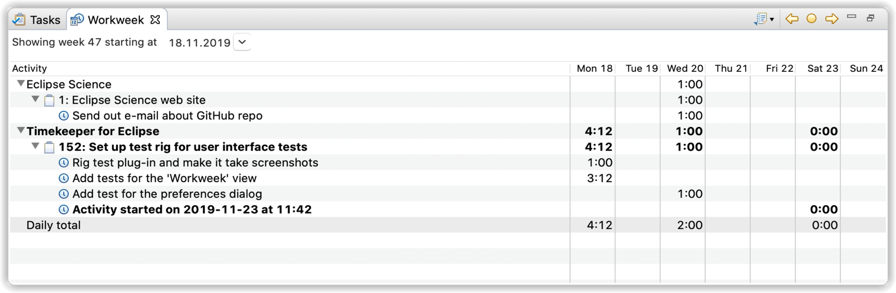
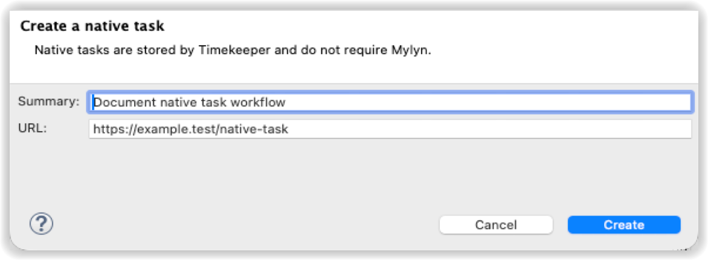
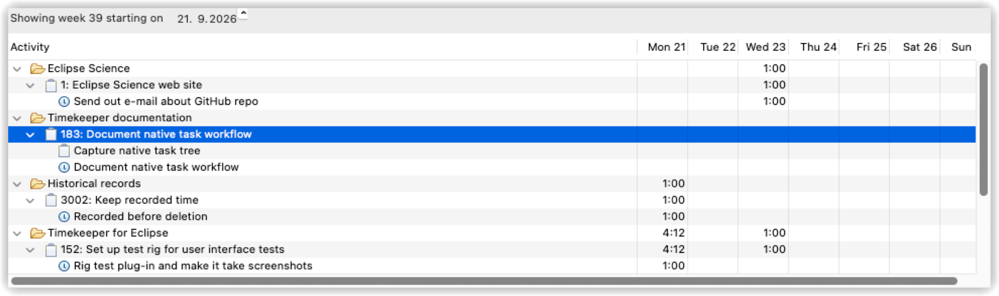
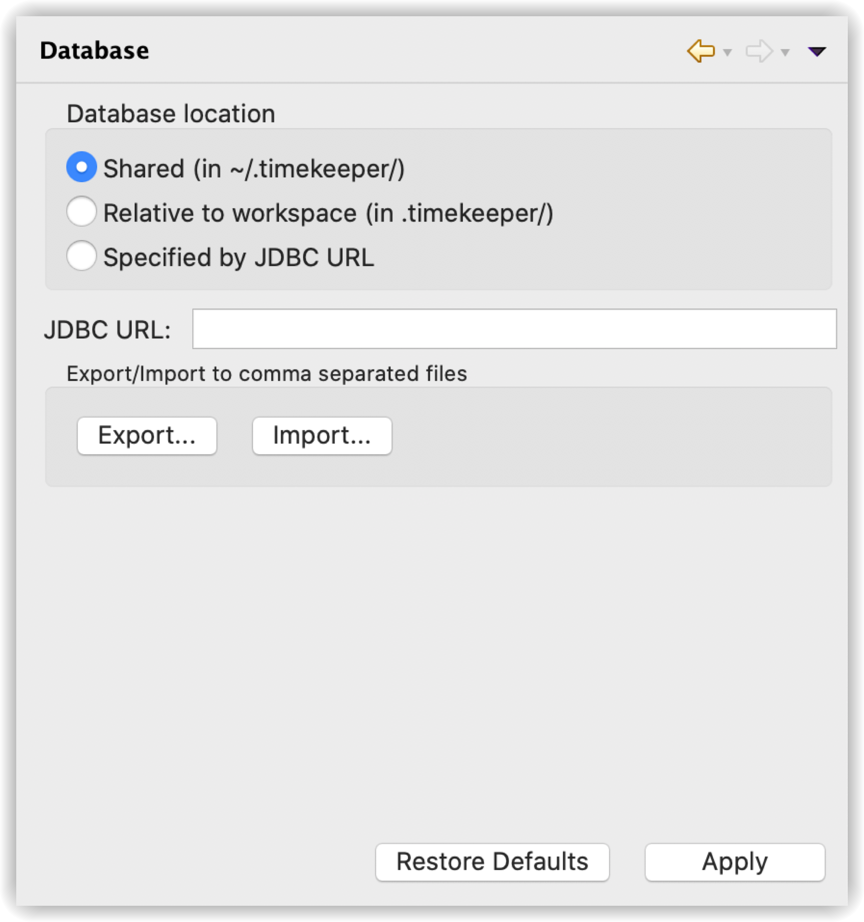

# Timekeeper for Eclipse 

This is a simple time-tracking plug-in for native Timekeeper tasks and
[Eclipse Mylyn](http://eclipse.org/mylyn/) Tasks.

Whenever a task is *activated* in Mylyn it will automatically show up in the **Workweek** view with a bold label, and the amount of time the task is active will be tracked. An *activity* will be added to the task, which is the entity keeping track of the time and a short note. Multiple activities can be added to each task.

When the task is *deactivated* the end time is registered on the activity and the active time is added to the total for the task on the particular day. It is also possible to manually edit the start and stop times by clicking into the cell.

The context menu and toolbar buttons can be used to browse back and forward by one week. The current locale is used to determine week numbers. Left of the navigation buttons there is a button for copying and exporting the displayed workweek in various formats. The export definitions can be modified or new ones can be added using [Freemarker](https://freemarker.apache.org) templates found in the preference settings. 

See the <a href="../../wiki">wiki</a>  for more about usage.

## Native Timekeeper tasks

Work can be organized and tracked without first creating a task in Mylyn or
another external system. Use **New Timekeeper project...** in the Workweek
toolbar to create a native project. The project appears directly in the tree;
use its context menu to create tasks, then use a task's context menu to create
subtasks.

Native projects, tasks, and subtasks are maintained in the Workweek view. A
double-click edits a task, while the context menu provides actions for editing,
deleting, starting or stopping activity tracking, opening an optional URL, and
linking or unlinking an external task. Recorded activities remain beneath the
task or subtask to which they belong.

A native task can later be linked to a provider such as GitHub or Jira without
changing its Timekeeper identity, hierarchy, or recorded history. Native tasks
participate in weekly totals, reports, and CSV export alongside tasks originating
in external systems.

The data is stored in an H2 SQL database, mapped to POJOs using the Java Persistence API with EclipseLink. Reports are generated using Apache FreeMarker. The database has an explicit schema version and initialization state; historical data migration is not supported.

In the 2.0 data model, a Timekeeper task has its own UUID and can be created,
edited and persisted without Mylyn. Mylyn, Jira, GitHub and future providers are
optional external references; each provider/repository/task tuple can be linked
to only one Timekeeper task. Recorded activities carry an explicit owner identity.
The embedded Eclipse client uses the stable owner `local`, while a future service
can supply authenticated user or service identities.

Activity and heartbeat timestamps are stored as UTC instants. Calendar operations
such as day and workweek totals require an explicit time zone; the Eclipse client
uses the host system zone. This keeps persisted data independent of the process
time zone while making daylight-saving and week-boundary behavior deterministic.

## Database configuration

The Database configuration page in preferences (**Timekeeper > Database**) allows you to configure where the database for the running Eclipse instance should be kept. The default is to place it in the shared location, under `.timekeeper` in your home folder. But you can also use a workspace relative path, or even a H2 server if you have one running.

Multiple instances of the Timekeeper can share the database as it utilizes a H2 feature called mixed mode. This will automatically start a server instance on port 9090 if more connections are needed.

The Eclipse 2026-09 upgrade uses **H2 2.5.250 with schema version 2** as its
supported database baseline. Start with new storage; historical H2 files,
unversioned databases and old Mylyn attribute records are not imported.
Schema versioning and guarded migration-target infrastructure are retained for
future migrations, but there are no active migration recipes or recovery buttons.
See the [complete data model and ER diagram](DATA-MODEL.md) and the
[database policy, backups and future migration contract](DATABASE-RECOVERY.md).

Keep unsupported databases intact and select a separate empty location. CSV
Export/Import now targets the current project, task, activity, external-reference
and relation tables, including native task hierarchy, but it remains a
convenience interchange format rather than a database backup, migration or
rollback mechanism.

## Installing

The latest **public release** is available from the [Eclipse
Marketplace](https://marketplace.eclipse.org/content/timekeeper-eclipse). Build
artifacts for the 2.0.0 release candidate are available from [GitHub
Actions](https://github.com/turesheim/eclipse-timekeeper/actions/workflows/build.yml).
Download the `p2-repository` artifact, extract it, and add the extracted directory
in **Help > Install New Software... > Add... > Local...**.

Timekeeper 2.0.0 requires Eclipse 2026-09 (4.41), Java 21 and Mylyn Tasks 4.12.
Keep the Eclipse 2026-09 software site enabled during installation so p2 can
resolve the complete Mylyn Tasks feature. Repository connectors such as Bugzilla
are optional.

The release candidate has been installed and updated in a clean Eclipse 4.41
runtime on macOS Apple Silicon. See the [installed-IDE acceptance
report](baseline/INSTALLED-IDE.md) for the verified behavior and the remaining
upstream Mylyn Error Log blocker. This is not yet a release certification.

## Supported environments

Timekeeper 2.0.0 targets Eclipse 2026-09 (4.41) on Java 21. The following
environments have direct acceptance evidence:

- macOS on Apple Silicon: clean build, installation, update, restart, data,
  manual-editing and native idle-detection checks;
- Linux x86_64 with X11: the complete automated build and UI suite under Xvfb;
- Windows x86_64: clean build, persistence tests and a native idle-detection
  smoke test.

macOS x86_64 and Linux aarch64 are build targets but have not received installed
runtime acceptance. Native idle detection is unavailable in a pure Wayland
session; it requires X11 or a usable XWayland `DISPLAY` with XScreenSaver. See
the [platform acceptance report](baseline/PLATFORM-ACCEPTANCE.md) for the full
support boundaries.

## Upgrade and rollback

Version 2.0.0 does not migrate databases from earlier releases. Before changing
an installation, stop every Eclipse instance and H2 server that uses Timekeeper,
preserve the old database and workspace, and configure 2.0.0 with a separate,
empty storage location. Do not point 2.0.0 at an old H2 file or unversioned
database.

To roll back the application, stop Eclipse, uninstall 2.0.0, reinstall the prior
Timekeeper release, and restore that release's original workspace, database and
database-location setting. Do not open a 2.0.0 schema with an older Timekeeper
or H2 version. Current-schema backup and restore instructions are in the
[database policy](DATABASE-RECOVERY.md).

## Building

Use JDK 21 and Maven 3.9.9 or newer. Clone the project and from the root execute:

    mvn -B -ntp clean verify -Dtycho.localArtifacts=ignore

When the build completes successfully there will be an Eclipse p2 repository at *net.resheim.eclipse.timekeeper-site/target/repository* which you can install from.

For Eclipse PDE development, open `default.target` and choose **Set as Active
Target Platform**. This is the authoritative target for both PDE and Maven,
using the dated Eclipse 2026-09 repository with pinned root dependencies.
Configure a JavaSE-21 execution environment in Eclipse. The development and
integration-test launch configurations use this environment and standard PDE
launchers; Java Mission Control is not required.

On Linux, run the UI tests under a graphical session or Xvfb, as in the GitHub
Actions workflow. Upgrade progress, known failures and migration requirements
are tracked in [UPGRADE-PLAN.md](UPGRADE-PLAN.md) and [baseline/README.md](baseline/README.md).

This project is using [JProfiler](https://www.ej-technologies.com/products/jprofiler/overview.html) for debugging performance issues.

## License

Copyright © 2014-2020 Torkild Ulvøy Resheim. All rights reserved. This program and the accompanying materials are made available under the terms of the Eclipse Public License v1.0 which accompanies this distribution, and is available at http://www.eclipse.org/legal/epl-v10.html
